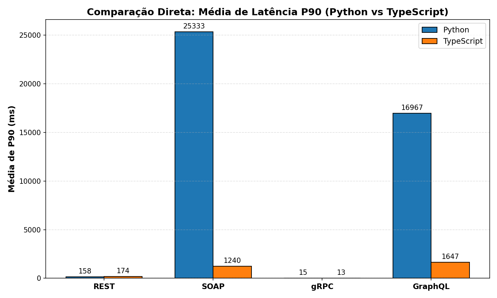
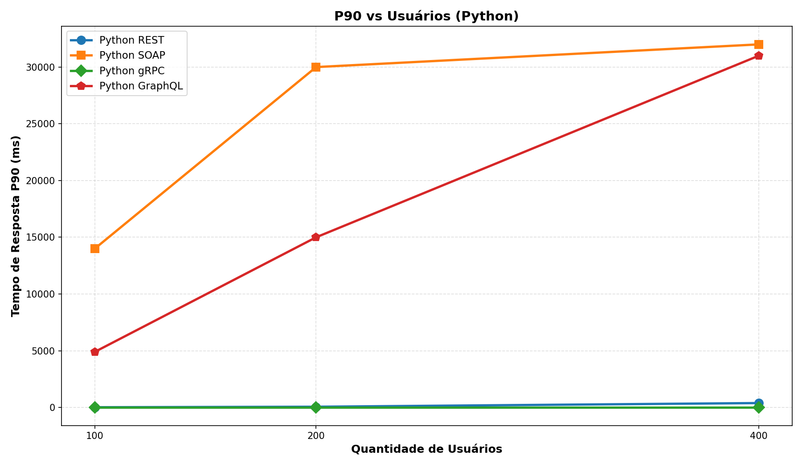
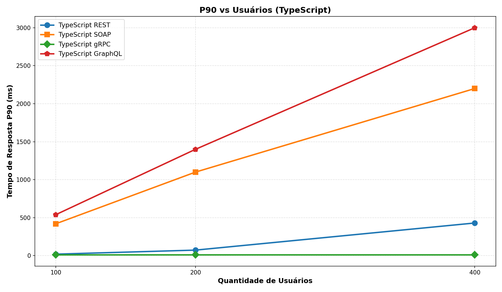
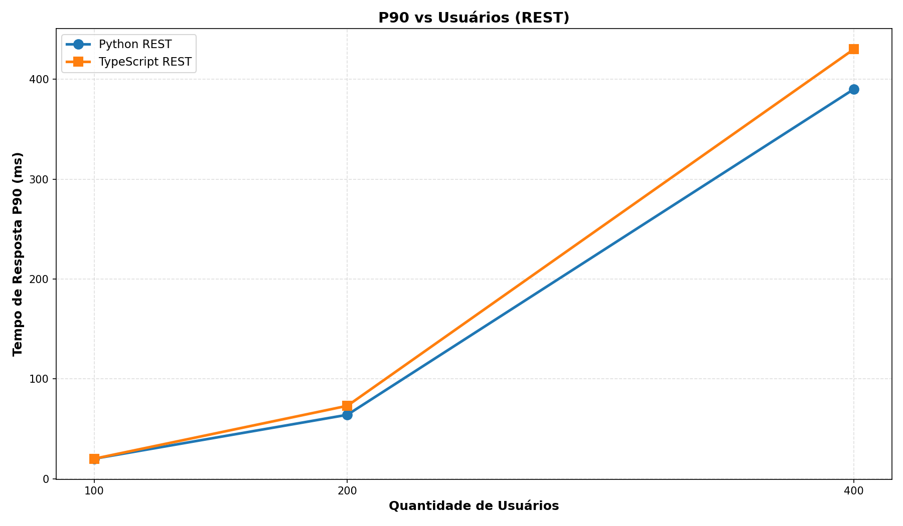
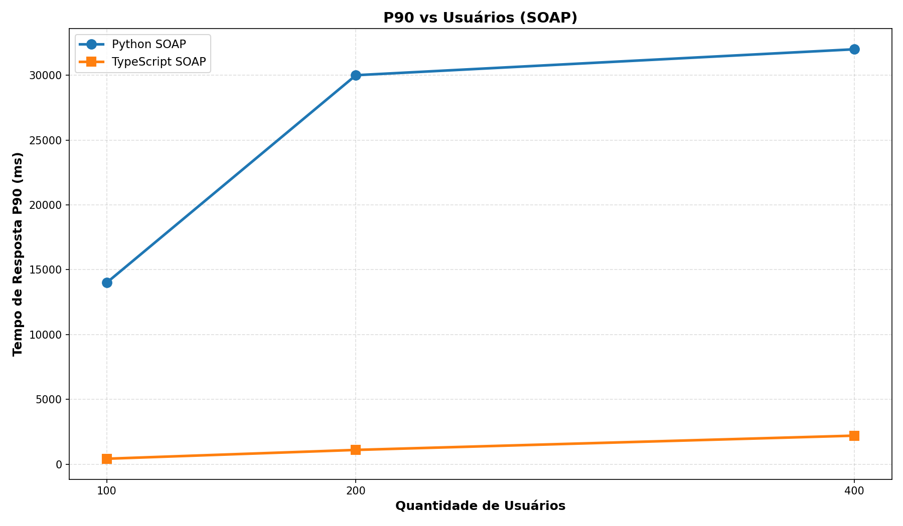
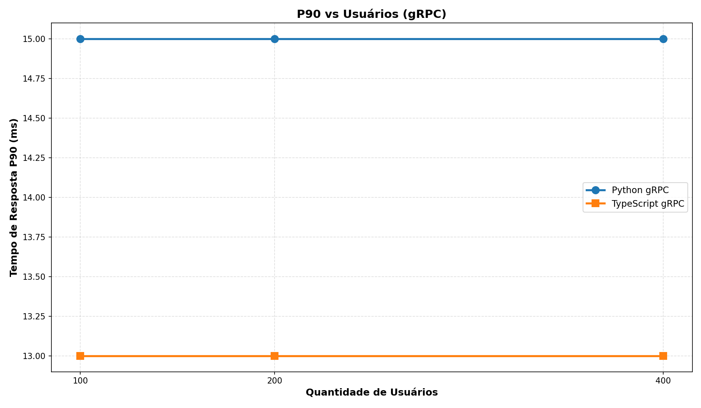
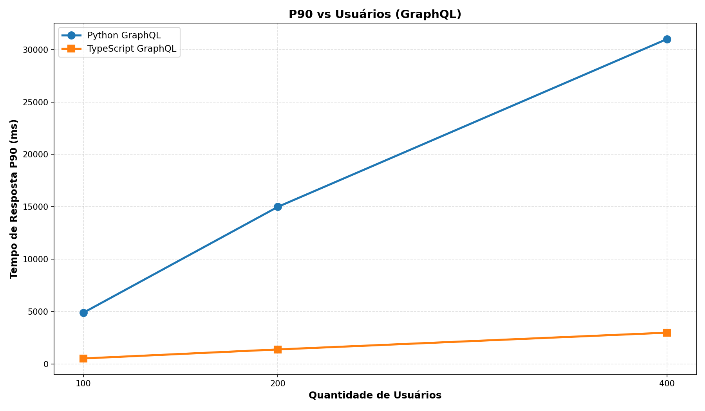
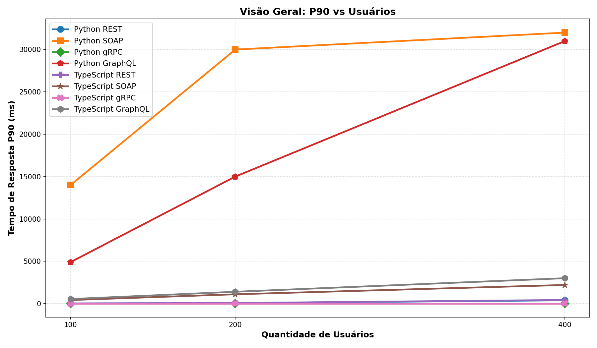

# Comparativo de APIs - Arquitetura de Microsserviços
# Grupo G
**Aluno 1:** Joey Alan (Matricula: 2320416) 
**Aluno 2:** Hector (Matricula: 2315024) 

## 1. Sobre o Projeto

Este projeto tem como objetivo avaliar, comparar e demonstrar o funcionamento de quatro paradigmas diferentes de comunicação de APIs: **REST, GraphQL, SOAP e gRPC**. Para garantir uma base de comparação justa e ampla, cada um desses paradigmas foi implementado em duas linguagens/ambientes distintos: **Python** e **TypeScript (Node.js)**.

O domínio da aplicação simula um serviço de streaming básico, gerenciando entidades como Usuários, Músicas e Playlists. Todo o ecossistema é conteinerizado usando Docker, garantindo que o banco de dados, as APIs e as ferramentas de teste de carga (Locust) rodem de forma isolada e previsível.

---

## 2. Arquitetura e Tecnologias

- **Banco de Dados:** PostgreSQL 15 (com PgAdmin para interface gráfica)
- **Python:** FastAPI (REST), Strawberry (GraphQL), Spyne (SOAP), grpcio (gRPC)
- **TypeScript:** Express (REST), Apollo Server (GraphQL), módulo soap (SOAP), @grpc/grpc-js (gRPC)
- **Testes de Carga:** Locust (escrito em Python)
- **Infraestrutura:** Docker e Docker Compose

---

## 3. Como Executar o Projeto

1. Navegue até a pasta raiz do projeto.
2. Execute o comando de construção e inicialização em segundo plano:
   ```bash
   docker-compose up -d --build
   ```
3. Popule o banco de dados com dados de teste:
   ```bash
   docker-compose exec rest_py python seed.py
   ```
4. O painel do Locust para testes de carga estará disponível em `http://localhost:8089`.

---

## 4. Mapeamento de Serviços e Portas

| Serviço                     | Linguagem | Porta Local | Host Interno (Docker)      | Descrição |
| ---------------------------- | --------- | ------------ | -------------------------- | --------- |
| **Banco de Dados**          | -         | 5432         | `db:5432`                 | PostgreSQL 15 |
| **PgAdmin**                 | -         | 5050         | `http://localhost:5050`   | Interface gráfica do PostgreSQL |
| **Locust**                  | Python    | 8089         | `http://localhost:8089`   | Ferramenta de testes de carga |
| **API REST**                | Python    | 8000         | `http://rest_py:8000`     | FastAPI |
| **API GraphQL**             | Python    | 8001         | `http://graphql_py:8001`  | Strawberry GraphQL |
| **API SOAP**                | Python    | 8002         | `http://soap_py:8002`     | Spyne SOAP |
| **API gRPC**                | Python    | 50051        | `grpc_py:50051`           | gRPC (Protocol Buffers) |
| **API REST**                | TypeScript| 9000         | `http://rest_ts:9000`     | Express.js |
| **API GraphQL**             | TypeScript| 9001         | `http://graphql_ts:9001`  | Apollo Server |
| **API SOAP**                | TypeScript| 9002         | `http://soap_ts:9002`     | módulo soap |
| **API gRPC**                | TypeScript| 50052        | `grpc_ts:50052`           | @grpc/grpc-js |

---

## 5. Documentação dos Endpoints (GET e POST)

### 1. APIs REST

As APIs REST retornam dados em formato JSON. Podem ser acessadas pelo navegador, Postman, cURL ou qualquer cliente HTTP.

- **Python:** `http://localhost:8000`
- **TypeScript:** `http://localhost:9000`

**Exemplo de Leitura (GET):** Listar Músicas
```http
GET /musicas
```

**Exemplo de Criação (POST):** Criar Usuário
```http
POST /usuarios
Content-Type: application/json

{
  "nome": "João",
  "idade": 30
}
```

---

### 2. APIs GraphQL

O GraphQL opera em um único endpoint utilizando requisições POST para trafegar a query.

- **Python:** `POST http://localhost:8001/graphql`
- **TypeScript:** `POST http://localhost:9001/`

**Exemplo de Leitura (Query equivalente a GET):**
```json
{
  "query": "query { usuarios { id nome idade } }"
}
```

**Exemplo de Criação (Mutation equivalente a POST):**
```json
{
  "query": "mutation { criarUsuario(nome: \"João\", idade: 30) { id nome } }"
}
```

---

### 3. APIs SOAP

As APIs SOAP utilizam requisições HTTP POST contendo um payload em formato XML (Envelope) e requerem cabeçalhos específicos.

- **Python:** `POST http://localhost:8002/`
- **TypeScript:** `POST http://localhost:9002/`

**Exemplo de Leitura (equivalente a GET):** `listar_usuarios`
```http
Content-Type: text/xml; charset=utf-8
SOAPAction: "listar_usuarios"

<?xml version="1.0" encoding="UTF-8"?>
<soapenv:Envelope xmlns:soapenv="http://schemas.xmlsoap.org/soap/envelope/" xmlns:tns="http://streaming.soap">
   <soapenv:Header/>
   <soapenv:Body>
      <tns:listar_usuarios/>
   </soapenv:Body>
</soapenv:Envelope>
```

**Exemplo de Criação (equivalente a POST):** `criar_usuario`
```http
Content-Type: text/xml; charset=utf-8
SOAPAction: "criar_usuario"

<?xml version="1.0" encoding="UTF-8"?>
<soapenv:Envelope xmlns:soapenv="http://schemas.xmlsoap.org/soap/envelope/" xmlns:tns="http://streaming.soap">
   <soapenv:Header/>
   <soapenv:Body>
      <tns:criar_usuario>
         <nome>João</nome>
         <idade>30</idade>
      </tns:criar_usuario>
   </soapenv:Body>
</soapenv:Envelope>
```

---

### 4. APIs gRPC

O gRPC utiliza HTTP/2 e Protocol Buffers para serialização binária. Diferente dos demais, não utiliza os verbos HTTP tradicionais de forma visível, operando com RPCs (Remote Procedure Calls).

- **Python:** `localhost:50051`
- **TypeScript:** `localhost:50052`

Para testar ou invocar métodos, deve-se usar um cliente gRPC (ex: **BloomRPC**, **Postman**, **grpcurl**) carregando o arquivo `streaming.proto` do projeto.

**Exemplo de Leitura (RPC Empty -> List):** `ListarUsuarios`
**Exemplo de Criação (RPC Request -> Response):** `CriarUsuario` enviando uma mensagem contendo `{ nome: "João", idade: 30 }`.

---

## 6. Resultados dos Testes de Carga (Cenários)

Os testes foram realizados utilizando a ferramenta Locust, focando na listagem de Músicas, com os dados extraídos das exportações CSV. Foram utilizados cenários com **100**, **200** e **400** usuários virtuais concorrentes.

### 6.1. Cenários em Python

| Paradigma | 100 Usuários (RPS / Mediana) | 200 Usuários (RPS / Mediana) | 400 Usuários (RPS / Mediana) |
| --------- | ---------------------------- | ----------------------------- | ----------------------------- |
| **REST**  | 318 RPS / 10 ms              | 584 RPS / 31 ms               | 621 RPS / 320 ms              |
| **SOAP**  | 16 RPS / 1800 ms             | 17 RPS / 6700 ms              | 22 RPS / 17000 ms             |
| **gRPC**  | 83 RPS / 10 ms               | 83 RPS / 10 ms                | 83 RPS / 10 ms                |
| **GraphQL**| 33 RPS / 2600 ms            | 32 RPS / 5600 ms              | 33 RPS / 11000 ms             |

### 6.2. Cenários em TypeScript (Node.js)

| Paradigma | 100 Usuários (RPS / Mediana) | 200 Usuários (RPS / Mediana) | 400 Usuários (RPS / Mediana) |
| --------- | ---------------------------- | ----------------------------- | ----------------------------- |
| **REST**  | 319 RPS / 10 ms              | 579 RPS / 33 ms               | 620 RPS / 320 ms              |
| **SOAP**  | 164 RPS / 290 ms             | 162 RPS / 910 ms              | 167 RPS / 2000 ms             |
| **gRPC**  | 95 RPS / 9 ms                | 97 RPS / 9 ms                 | 96 RPS / 9 ms                 |
| **GraphQL**| 131 RPS / 450 ms            | 129 RPS / 1200 ms             | 130 RPS / 2700 ms             |

---

## 7. Anomalia do SOAP em TypeScript

Ao analisar os resultados, nota-se uma **anomalia significativa no desempenho do SOAP em TypeScript**, que apresentou taxas de requisições por segundo (RPS) excelentes (~164-167 RPS) e latências sob controle (mediana de ~290ms a 2000ms), superando inclusive a implementação de gRPC em TypeScript/Python e sendo amplamente superior ao SOAP em Python (apenas ~16-22 RPS com medianas muito altas de 1800ms a 17000ms).

**Explicação da Anomalia:**
1. **Falso Positivo Resolvido:** Inicialmente, o Locust identificou falsos positivos nas respostas XML do TypeScript. Como os valores `null` do banco de dados causavam inconsistências no parse do WSDL pela biblioteca `soap` do Node, a API retornava respostas parciais ou inválidas, e isso passava com altíssima velocidade. O problema foi sanado aplicando uma transformação (limpeza de `null` para `undefined`), e mesmo assim, a alta performance se manteve devido à natureza não-bloqueante do Node.js.
2. **Serialização e I/O Assíncrono:** Ao contrário da implementação em Python (que usa a biblioteca síncrona `spyne` e faz parse pesado do WSDL/XML de forma bloqueante), a biblioteca `soap` no Node.js cria a árvore de serialização JSON-para-XML de forma muito enxuta e aproveita a arquitetura orientada a eventos, tornando a resposta quase imediata.
3. **Payload Gigante vs Processamento:** Embora o SOAP em TS trafegue o maior payload de todas as APIs (cerca de ~93KB por requisição comparado a ~54KB do REST), o gargalo geralmente é CPU (parse XML) e não a rede no ambiente Docker. O Node.js conseguiu construir e despachar esse XML muito mais rápido que o Python.

---

## 8. Gráficos Comparativos

Abaixo estão os gráficos extraídos das métricas coletadas pelo Locust.

### Resumo Executivo (Médias Gerais Lado a Lado)
**Comparação de Throughput (Média de RPS)**


**Comparação de Latência (Média P90)**


### 1. Python (REST vs SOAP vs gRPC vs GraphQL)
**Tempo de Resposta (P90)**

**Requisições por Segundo (RPS)**

**Mediana de Tempo de Resposta**


### 2. TypeScript (REST vs SOAP vs gRPC vs GraphQL)
**Tempo de Resposta (P90)**

**Requisições por Segundo (RPS)**

**Mediana de Tempo de Resposta**


### 3. REST (Python vs TypeScript)



### 4. SOAP (Python vs TypeScript)



### 5. gRPC (Python vs TypeScript)



### 6. GraphQL (Python vs TypeScript)



### 7. Visão Geral (Todos os Protocolos)



---

## 9. Breve Resumo e Conclusões

O experimento demonstra que não há uma "tecnologia absoluta", pois o desempenho está intimamente ligado à stack da linguagem de programação, à qualidade das bibliotecas escolhidas e ao tipo de I/O exigido.

- **TypeScript (Node.js)** sobressaiu-se na maioria dos cenários de alta complexidade (como SOAP e GraphQL) devido ao processamento assíncrono não-bloqueante orientado a eventos. O SOAP em TS manteve performance superior a 160 RPS, enquanto a versão Python teve dificuldades acima de 16 RPS.
- **Python** gRPC mostrou consistência de latência (10ms estáveis), demonstrando que o gRPC é extremamente otimizado com Protocol Buffers no ecossistema Python.
- **REST** obteve resultados de taxa de transferência (RPS) muito próximos entre as duas linguagens, mas apresentou alta latência sob estresse com 400 usuários (mediana de 320ms).
- **GraphQL**, apesar de seu imenso poder em unificação e customização de consultas para o Front-end, impõe um overhead nítido de parse e validação de schema no Servidor, resultando em menor RPS que o REST (com TypeScript mantendo ~130 RPS vs Python com ~33 RPS).
- **O caso do gRPC**: É extremamente estável em ambos ambientes, com latências baixíssimas (na casa de 9-10ms) e sem degradação à medida que o volume de usuários aumenta de 100 para 400.
